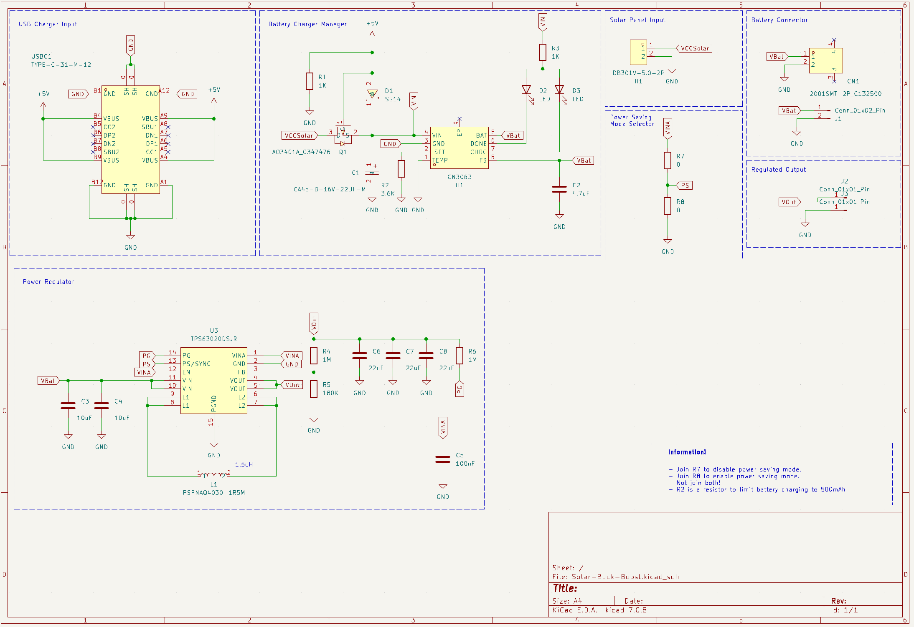
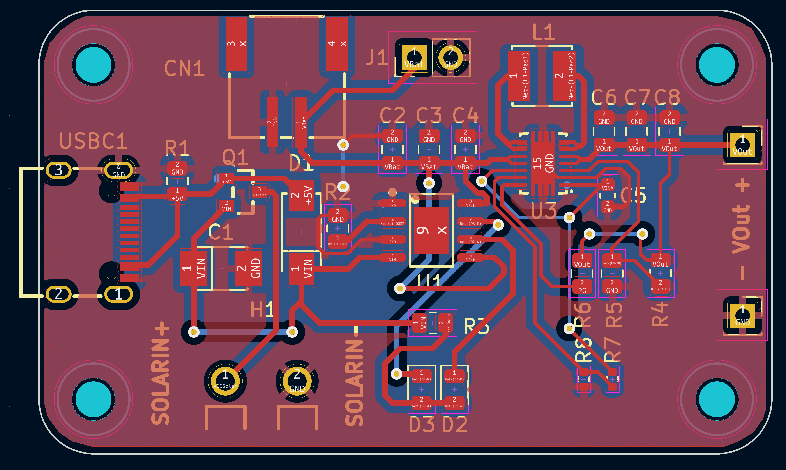

#Solar Buck-Boost

Li-Po charging module with CN3063 and TPS63020 for solar and USB power, ensures constant voltage and efficiency. By default it's configure to ouput 3.3v with power saving mode off.

**Important you can use a solar panel with a maximum of 6V and minimum of 4.4v, but it's recommendable to use 5V solar panel modules**

## Configuration:

This modules allows to set the output voltage an working mode by doing some little modifications.

## Output Voltage:

This module allows to set an ouput voltage by changing R4 resistor. By default it's 1M giving an ouput of 3.3v, but you can get the following ouput values.

| VOUT  |   R4   |
|-------|--------|
| 2.5V  | 750K   |
| 3.3V  | 1M     |
| 3.6V  | 1.1M   |
| 4.5V  | 1.43M  |
| 5V    | 1.6M   |

## Power saving mode:

- Power saving mode on: Join R8.
- Power saving mode off: Join R7.

## Schematics:

## PCB:

## Bill of materials:

You can find a list of material with a link to the crucial one.

